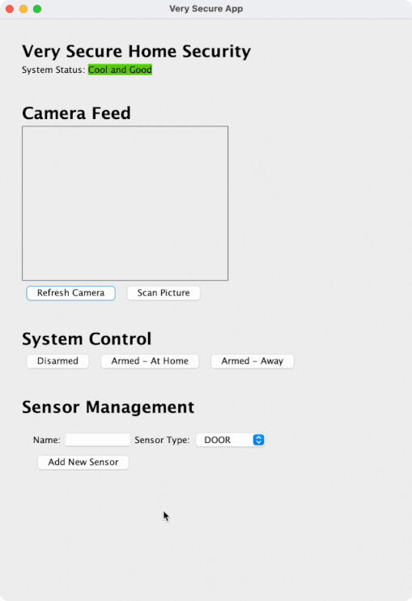

# Udasecurity - home security app

Real-world project from [Java Programming Nanodegree](https://www.udacity.com/course/java-programming-nanodegree--nd079) at Udacity.

The UdaSecurity program is a basic GUI application that allows users to perform various tasks related to managing their home security system.

This application tracks the status of sensors, monitors camera input, and changes the alarm state of the system based on inputs. Users can arm the system for when they’re home or away as well as disarm the system.

## Summary

- [Demo](#demo)
- [Dependencies](#dependencies)
- [Goals](#goals)
- [Usage](#usage)
- [Requirements](#requirements)
- [License](#license)

## Demo



## Dependencies

- [Maven](https://maven.apache.org/) 3.8.5
- [JUnit](https://junit.org/junit5/) 5.8.2
- [Mockito](https://site.mockito.org/) 4.5.1
- [Spotbugs Maven Plugin](https://spotbugs.readthedocs.io/en/stable/maven.html) 4.7.0.0

## Goals

To prepare to scale the software, it’s going to need some revisions:

- Split the project into multiple modules.
- Refactor it to be unit-testable.
- Write unit tests to cover all the main requirements for the Security portion of the application.
- Fix any bugs that are found in the process.
- Update the build process to automatically run unit tests.
- Perform static code analysis.
- Build the code into an executable jar file.

## Usage

1. In the ```root``` directory:
```
$ git clone https://github.com/Foystor/udasecurity-home-security.git
```

2. Get to the ```target``` directory of the Security service module:
```
$ cd udasecurity-home-security/catpoint-parent/securitymodule/target
```
3. Run the executable JAR:
```
$ java -jar securitymodule-1.0-SNAPSHOT-jar-with-dependencies.jar
```

## Requirements

Application Requirements to Test:

1. If alarm is armed and a sensor becomes activated, put the system into pending alarm status.
2. If alarm is armed and a sensor becomes activated and the system is already pending alarm, set the alarm status to alarm on. [This is the case where all sensors are deactivated and then one gets activated]
3. If pending alarm and all sensors are inactive, return to no alarm state.
4. If alarm is active, change in sensor state should not affect the alarm state.
5. If a sensor is activated while already active and the system is in pending state, change it to alarm state. [This is the case where one sensor is already active and then another gets activated]
6. If a sensor is deactivated while already inactive, make no changes to the alarm state.
7. If the camera image contains a cat while the system is armed-home, put the system into alarm status.
8. If the camera image does not contain a cat, change the status to no alarm as long as the sensors are not active.
9. If the system is disarmed, set the status to no alarm.
10. If the system is armed, reset all sensors to inactive.
11. If the system is armed-home while the camera shows a cat, set the alarm status to alarm.

## License

[MIT License](LICENSE)